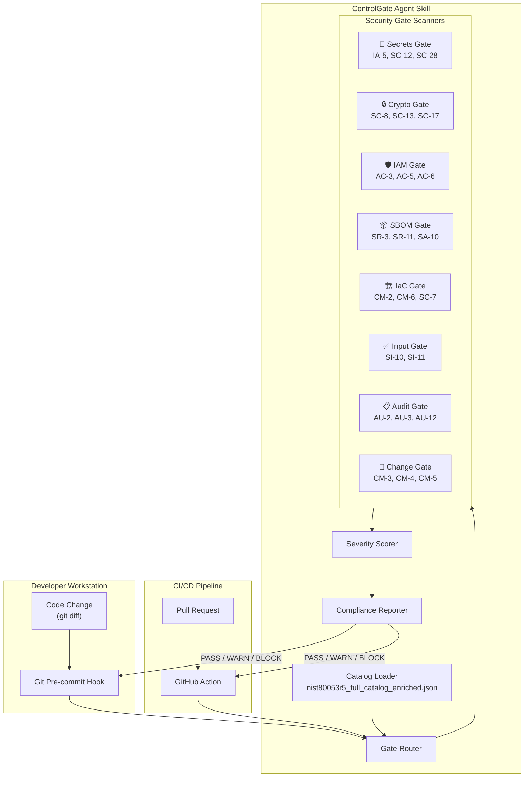

# ControlGate — NIST RMF Cloud Security Hardening Skill

An agent skill that acts as an **automated compliance gate** before every `git commit` and `git merge`, evaluating code changes against the NIST SP 800-53 Rev. 5 security controls from the enriched NCSB catalog.

---

## The Problem

Developers introduce cloud security misconfigurations daily — hardcoded secrets, open storage buckets, missing encryption, overly permissive IAM — and these issues are only caught **late** (in CI, or worse, in production). NIST 800-53 R5 defines 1,189 security controls, **370 of which are non-negotiable** at the Moderate baseline. No human can remember all of them, and existing tools are point-solutions that don't map findings back to a compliance framework.

## The Idea

**ControlGate** is an AI-powered agent skill that:
1. **Loads** the enriched NCSB catalog (`nist80053r5_full_catalog_enriched.json`) as its knowledge base
2. **Intercepts** code at `pre-commit` and `pre-merge` (PR) checkpoints
3. **Scans** diffs against 8 security gate domains derived from the catalog
4. **Produces** a verdicts report linking every finding to specific NIST control IDs, severity, and remediation guidance
5. **Blocks or warns** based on configurable severity thresholds

---

## Architecture



---

## The Eight Security Gates

Each gate maps directly to non-negotiable NIST controls and runs specific scans on the code diff.

### Gate 1 — 🔑 Secrets & Credential Gate

| NIST Controls | Severity | What it Catches |
|---|---|---|
| **IA-5** (Authenticator Management) | MEDIUM | Hardcoded passwords, API keys, tokens |
| **IA-6** (Authentication Feedback) | MEDIUM | Credentials in logs or error messages |
| **SC-12** (Crypto Key Mgmt) | MEDIUM | Private keys committed to repo |
| **SC-28** (Protection at Rest) | HIGH | Unencrypted secrets in config files |

**Scan logic**: Regex + entropy detection on diffs to find high-entropy strings, known key patterns (AWS, GCP, Azure key formats), `.env` files with secrets, PEM/PKCS files.

---

### Gate 2 — 🔒 Cryptography & TLS Gate

| NIST Controls | Severity | What it Catches |
|---|---|---|
| **SC-8** (Transmission Confidentiality) | HIGH | HTTP endpoints without TLS enforcement |
| **SC-13** (Cryptographic Protection) | MEDIUM | Weak algorithms (MD5, SHA1, DES, RC4) |
| **SC-17** (PKI Certificates) | HIGH | Self-signed certs in production config |
| **SC-23** (Session Authenticity) | HIGH | Missing session integrity mechanisms |

**Scan logic**: AST/pattern scan for deprecated crypto functions, `http://` URLs in production configs, `ssl_verify=False`, weak cipher suites.

---

### Gate 3 — 🛡️ IAM & Access Control Gate

| NIST Controls | Severity | What it Catches |
|---|---|---|
| **AC-3** (Access Enforcement) | MEDIUM | Missing authorization checks on endpoints |
| **AC-5** (Separation of Duties) | HIGH | Admin + user roles in same code path |
| **AC-6** (Least Privilege) | HIGH | Wildcard IAM policies (`*` permissions) |
| **AC-4** (Information Flow) | HIGH | Uncontrolled data exposure across trust boundaries |

**Scan logic**: IaC policy analysis for `"Action": "*"` or `"Resource": "*"`, route handlers without auth middleware, overly broad CORS configurations.

---

### Gate 4 — 📦 Supply Chain & SBOM Gate

| NIST Controls | Severity | What it Catches |
|---|---|---|
| **SR-3** (Supply Chain Controls) | MEDIUM | New dependencies without lockfiles |
| **SR-11** (Component Authenticity) | MEDIUM | Unpinned package versions |
| **SA-10** (Developer Config Mgmt) | HIGH | Modified build pipelines without review |
| **SA-11** (Developer Testing) | HIGH | Removed or weakened test coverage |

**Scan logic**: Detect changes to `package.json`, `requirements.txt`, `go.mod`, `Cargo.toml` without corresponding lockfile updates; flag `>=` or `*` version specifiers; detect decreasing test coverage thresholds.

---

### Gate 5 — 🏗️ Infrastructure-as-Code (IaC) Gate

| NIST Controls | Severity | What it Catches |
|---|---|---|
| **CM-2** (Baseline Configuration) | MEDIUM | Deviation from approved base images |
| **CM-6** (Configuration Settings) | MEDIUM | Insecure default configurations |
| **CM-7** (Least Functionality) | MEDIUM | Unnecessary exposed ports/services |
| **SC-7** (Boundary Protection) | MEDIUM | `0.0.0.0/0` ingress rules, public subnets |

**Scan logic**: Parse Terraform, CloudFormation, Kubernetes YAML for: public S3/GCS buckets, security groups with `0.0.0.0/0`, containers running as root, missing resource limits, Dockerfile `USER root`.

---

### Gate 6 — ✅ Input Validation & Error Handling Gate

| NIST Controls | Severity | What it Catches |
|---|---|---|
| **SI-10** (Input Validation) | HIGH | SQL concatenation, unsanitized user input |
| **SI-11** (Error Handling) | HIGH | Stack traces exposed to users |
| **SI-16** (Memory Protection) | HIGH | Buffer handling without bounds checks |
| **SI-7** (Integrity) | HIGH | Missing integrity verification on downloads |

**Scan logic**: Detect f-string/format SQL queries, `eval()`/`exec()` with user input, broad `except: pass` blocks, missing input sanitization in API handlers.

---

### Gate 7 — 📋 Audit & Logging Gate

| NIST Controls | Severity | What it Catches |
|---|---|---|
| **AU-2** (Event Logging) | MEDIUM | Security events without logging |
| **AU-3** (Audit Record Content) | MEDIUM | Logs missing required fields (who, what, when) |
| **AU-12** (Audit Generation) | MEDIUM | Disabled or removed logging statements |

**Scan logic**: Detect auth/access-control functions without logging, deletion of log statements in security-critical paths, PII in log outputs.

---

### Gate 8 — 🔄 Change Control Gate

| NIST Controls | Severity | What it Catches |
|---|---|---|
| **CM-3** (Change Control) | HIGH | Changes to security-critical files without required reviewers |
| **CM-4** (Impact Analysis) | MEDIUM | Missing impact documentation for config changes |
| **CM-5** (Access Restrictions) | MEDIUM | Unauthorized modifications to deployment configs |

**Scan logic**: Enforce CODEOWNERS for security-critical paths, require change tickets/issue references in commits modifying infrastructure, flag direct pushes to protected branches.

---

## Verdict System

ControlGate produces a structured verdict for each scan:

```json
{
  "verdict": "BLOCK",
  "timestamp": "2026-02-19T23:00:00Z",
  "summary": "2 BLOCK, 3 WARN, 5 PASS findings",
  "baseline_target": "moderate",
  "findings": [
    {
      "gate": "secrets",
      "control_id": "IA-5",
      "control_name": "Authenticator Management",
      "severity": "MEDIUM",
      "non_negotiable": true,
      "file": "config/database.py",
      "line": 42,
      "description": "Hardcoded database password detected",
      "evidence": "DB_PASSWORD = \"super_secret_123\"",
      "remediation": "Move to environment variable or secrets manager (AWS SSM, GCP Secret Manager, Azure Key Vault)",
      "action": "BLOCK"
    }
  ],
  "gate_summary": {
    "secrets": {"status": "BLOCK", "findings": 1},
    "crypto": {"status": "PASS", "findings": 0},
    "iam": {"status": "WARN", "findings": 2},
    "sbom": {"status": "PASS", "findings": 0},
    "iac": {"status": "WARN", "findings": 1},
    "input_validation": {"status": "PASS", "findings": 0},
    "audit": {"status": "PASS", "findings": 0},
    "change_control": {"status": "BLOCK", "findings": 1}
  }
}
```

### Action Levels

| Level | Trigger | Behavior |
|---|---|---|
| **BLOCK** | Any CRITICAL or HIGH + `non_negotiable=true` finding | Reject the commit/merge |
| **WARN** | MEDIUM + `non_negotiable=true` or any HIGH finding | Allow with warning, log to compliance dashboard |
| **PASS** | No findings or LOW-only findings | Allow silently |

---

## Proposed Project Structure

```
controlgate/
├── CONTROLGATE_DESIGN.md             # This design document
├── README.md                         # Project overview
├── pyproject.toml                    # Python packaging
├── .controlgate.yml                  # Default configuration
├── src/controlgate/
│   ├── __init__.py
│   ├── __main__.py                   # CLI entry point
│   ├── engine.py                     # Core ControlGate engine
│   ├── catalog.py                    # NCSB catalog loader + query API
│   ├── diff_parser.py                # Git diff parsing
│   ├── gates/
│   │   ├── __init__.py
│   │   ├── base.py                   # Abstract gate class
│   │   ├── secrets_gate.py           # Gate 1: IA-5, SC-12, SC-28
│   │   ├── crypto_gate.py            # Gate 2: SC-8, SC-13
│   │   ├── iam_gate.py               # Gate 3: AC-3, AC-5, AC-6
│   │   ├── sbom_gate.py              # Gate 4: SR-3, SR-11, SA-10
│   │   ├── iac_gate.py               # Gate 5: CM-2, CM-6, SC-7
│   │   ├── input_gate.py             # Gate 6: SI-10, SI-11
│   │   ├── audit_gate.py             # Gate 7: AU-2, AU-3
│   │   └── change_gate.py            # Gate 8: CM-3, CM-4
│   ├── reporters/
│   │   ├── __init__.py
│   │   ├── json_reporter.py          # JSON verdict output
│   │   ├── markdown_reporter.py      # Human-readable PR comment
│   │   └── sarif_reporter.py         # SARIF for GitHub Code Scanning
│   └── config.py                     # Configurable thresholds & gate toggling
├── hooks/
│   ├── pre_commit.py                 # Git pre-commit hook entry point
│   └── github_action.yml             # GitHub Action for PR gating
├── tests/
│   ├── test_catalog.py
│   ├── test_engine.py
│   ├── test_gates/
│   │   ├── test_secrets_gate.py
│   │   ├── test_crypto_gate.py
│   │   └── ...
│   └── fixtures/
│       └── sample_diffs/             # Test diff fixtures
└── schemas/
    └── verdict_schema.json           # JSON Schema for verdict output
```

---

## Catalog Query API

The skill reads `nist80053r5_full_catalog_enriched.json` and builds an in-memory index:

```python
class CatalogIndex:
    """Queryable index over the enriched NIST 800-53 R5 catalog."""

    def by_id(self, control_id: str) -> Control
    def by_family(self, family: str) -> list[Control]
    def by_severity(self, severity: str) -> list[Control]
    def non_negotiable(self) -> list[Control]
    def for_gate(self, gate_name: str) -> list[Control]
    def related_to(self, control_id: str) -> list[Control]
```

Every finding links back to specific control metadata:
- `control_id` → for traceability to NIST framework
- `severity` → drives BLOCK/WARN/PASS decision
- `non_negotiable` → escalates action level
- `baseline_membership` → contextualizes against target baseline
- `control_text` → provides authoritative remediation context
- `related_controls` → surfaces adjacent security concerns

---

## Configuration (`.controlgate.yml`)

```yaml
# ControlGate Configuration
baseline: moderate              # Target NIST baseline (low | moderate | high)
catalog: baseline/nist80053r5_full_catalog_enriched.json

gates:
  secrets:    { enabled: true,  action: block }
  crypto:     { enabled: true,  action: block }
  iam:        { enabled: true,  action: warn  }
  sbom:       { enabled: true,  action: warn  }
  iac:        { enabled: true,  action: block }
  input:      { enabled: true,  action: block }
  audit:      { enabled: true,  action: warn  }
  change:     { enabled: true,  action: warn  }

thresholds:
  block_on:   [CRITICAL, HIGH]  # Block if finding severity matches
  warn_on:    [MEDIUM]          # Warn for these severities
  ignore:     [LOW]             # Skip LOW-severity findings

exclusions:
  paths:
    - "tests/**"
    - "docs/**"
    - "*.md"
  controls:
    - AC-13     # Withdrawn controls
    - AC-15

reporting:
  format: [json, markdown]
  sarif: false
  output_dir: .controlgate/reports
```

---

## Implementation Phases

### Phase 1 — Foundation (MVP)
- **Catalog loader** (`catalog.py`): Load and index the enriched JSON, provide query API by control_id, family, severity, non_negotiable
- **Gate base class** (`base.py`): Abstract interface with `scan(diff) → list[Finding]`
- **Secrets Gate** (highest impact, lowest complexity): Regex patterns, entropy analysis
- **Verdict engine** (`engine.py`): Orchestrate gates, score findings, produce verdict
- **Pre-commit hook**: Wire into `git commit` via `.pre-commit-config.yaml`

### Phase 2 — Core Gates
- Add Crypto, IAM, IaC, and Input Validation gates
- JSON + Markdown reporters
- Configuration file support (`.controlgate.yml`)

### Phase 3 — CI/CD Integration
- GitHub Action for PR-level gating
- SARIF reporter for GitHub Code Scanning integration
- SBOM and Change Control gates
- Audit Gate with PR compliance annotations

### Phase 4 — Intelligence Layer
- LLM-powered contextual analysis for nuanced findings
- Auto-remediation suggestions with code snippets
- Compliance posture scoring over time
- Team dashboard integration

---

## Data Source

All control data is sourced from the **NIST Cloud Security Baseline (NCSB)** project:
- Catalog: [nist80053r5_full_catalog_enriched.json](https://github.com/sadayamuthu/nist-cloud-security-baseline)
- Framework: NIST SP 800-53 Rev. 5
- Baseline: NIST SP 800-53B

### Catalog Statistics
- **1,189** total controls across **20** families
- **370** non-negotiable controls (at Moderate baseline)
- **247** code-relevant non-negotiable controls across 10 families
- Severity distribution: 766 LOW, 202 MEDIUM, 138 HIGH, 83 CRITICAL

---

## License

MIT
